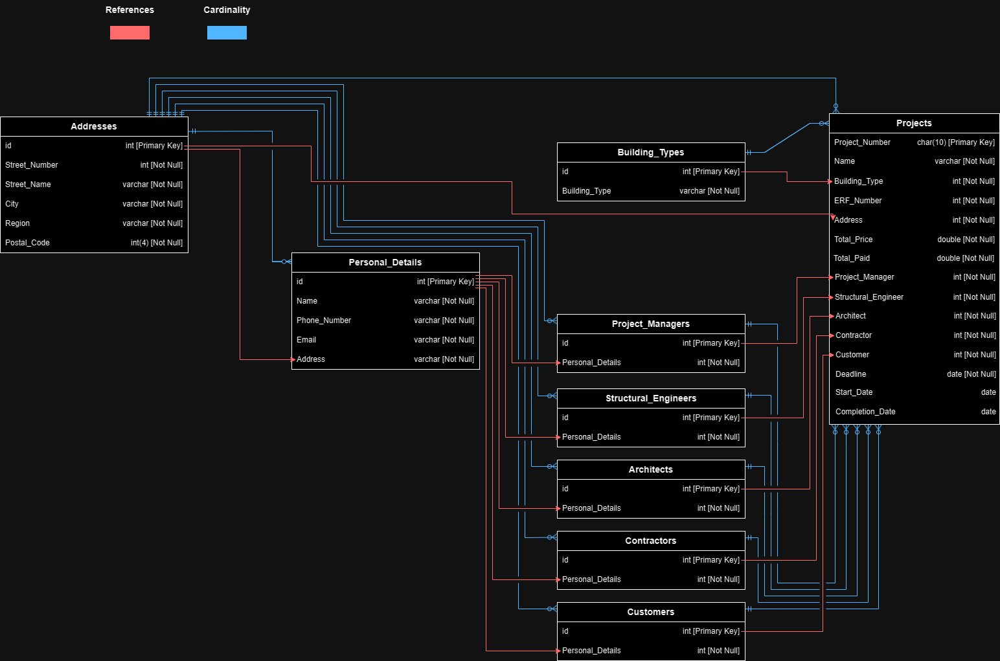
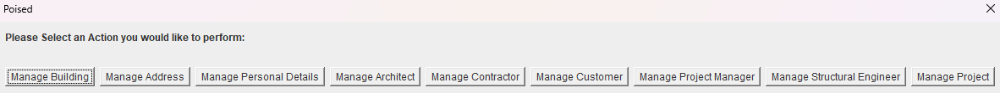
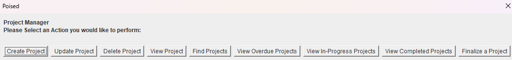

# Poised PMS

Poised PMS is a Project Management System made for the Construction Company "Poised". This System Allows Administration to Manage Construction Projects.

The Sysetm Provides a Clean User Interface for Adding, Editing, and Removing Projects, furthermore, Administration can Interact with Project Details, Track Progress, and Manage Roles and Human Resources from the User Interface.

## Authors

- [Shandre Lourens](https://www.github.com/JackNytely)

## Support

For any support, questions, or discussions related to the Poised project, feel free to join our Discord community:

[Nytely Development Community](https://discord.gg/RDvkenQsPj)

## Installation

1. Clone the Repository
2. Setup the Required Database using the Provided "PoisedPMS.sql" file
3. Configure the Project Details in the Main Java File "Poised.java"
4. Run the Application to Start Managing the Projects

## Contributing

Contributions are always welcome!

You only need to Fork the Project, make the Desired Changes and Submit a Pull Request.

## Screenshots

## Documentation

[Documentation](./Documentation)
